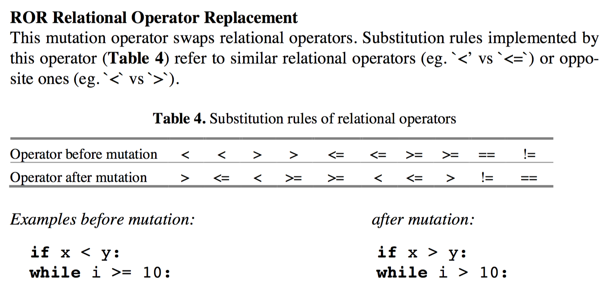
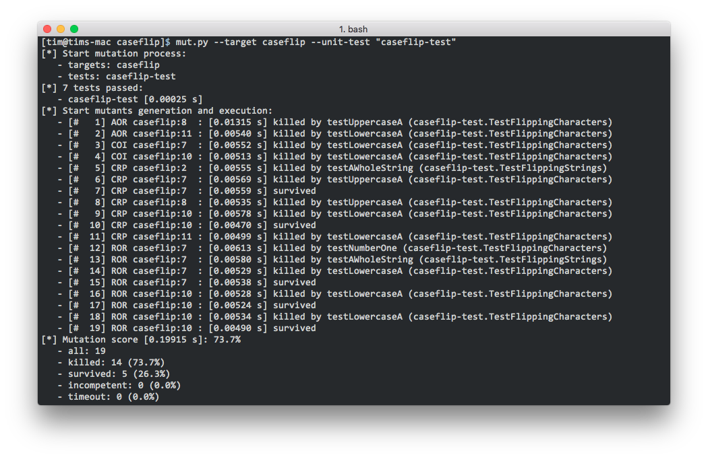
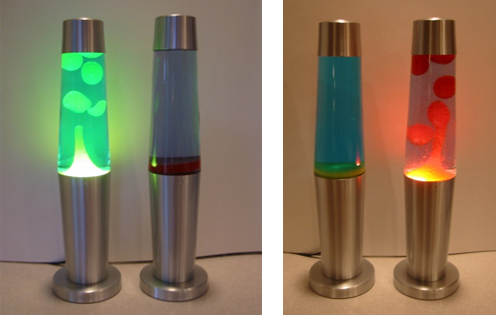
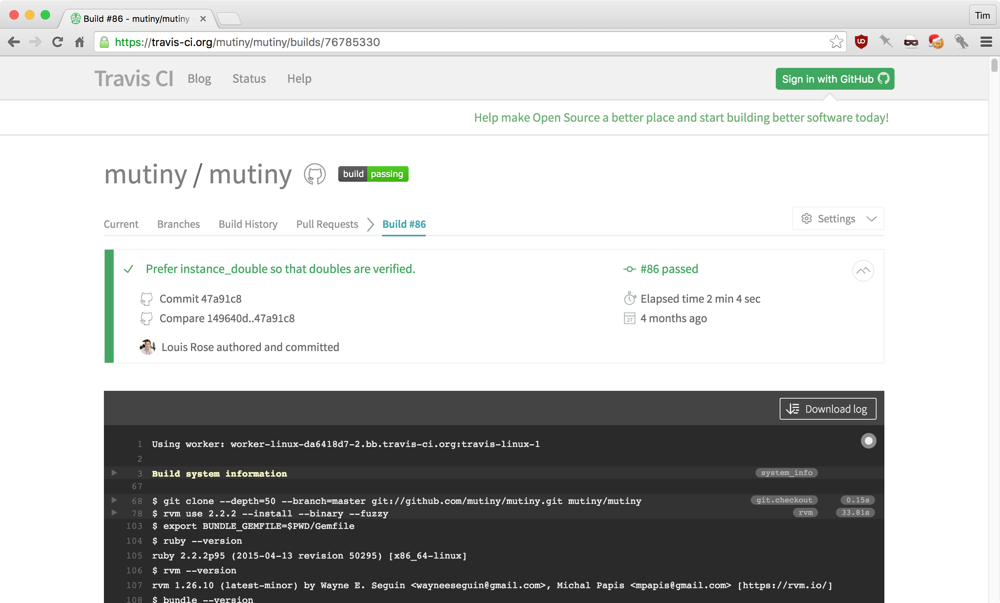
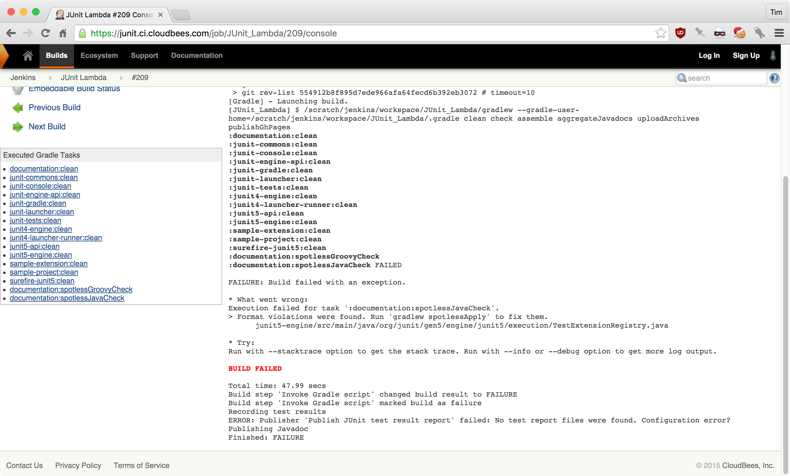
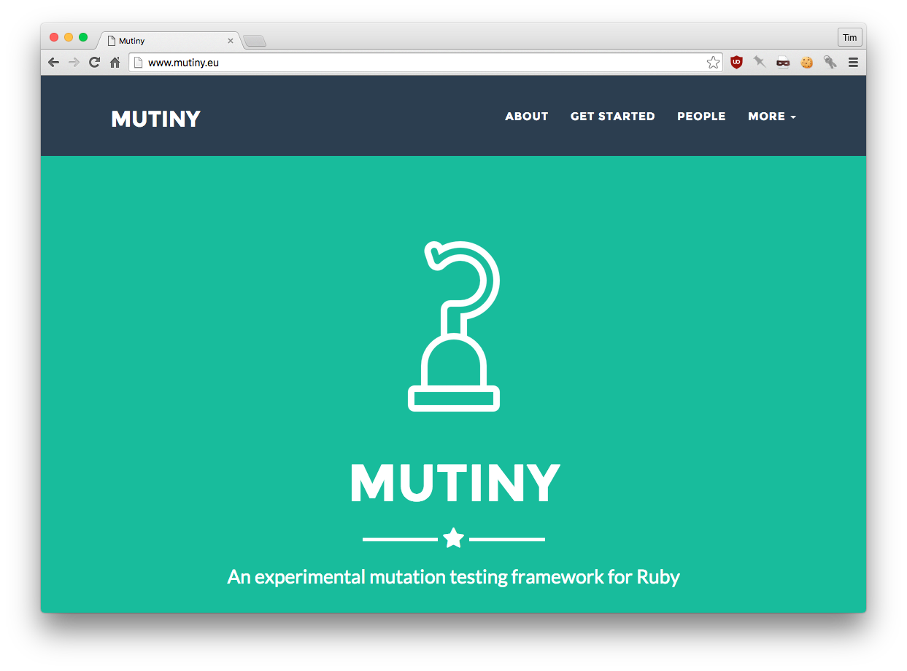
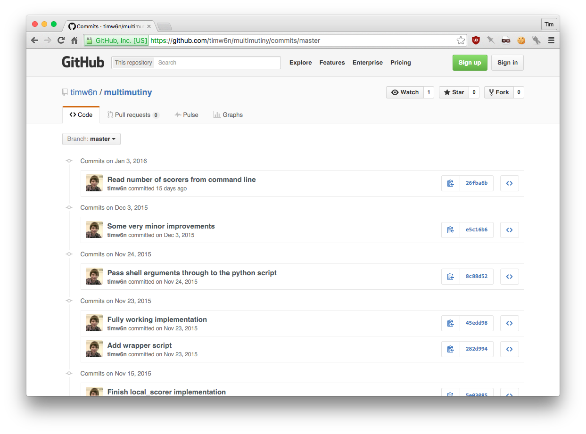
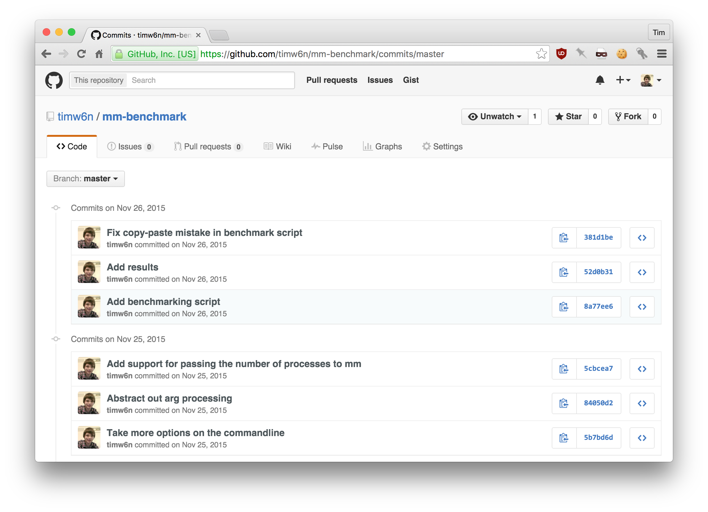

% Including mutation testing as part of a continuous integration workflow
% Tim Waterson

# What is mutation testing?

---

If our application code breaks, will our tests detect that?

---

``` {.python}
def flip(char):
  codepoint = ord(char)

  if 64 < codepoint < 91:
    return chr(codepoint + 32)

  if 96 < codepoint < 123:
    return chr(codepoint - 32)

  return char
```

---

* `'a'` → `'A'`
* `'z'` → `'Z'`
* `'1'` → `'1'`
* `'Z'` → `'z'`
* `'A'` → `'a'`
* `'+'` → `'+'`

---



---

``` {.python}
def flip(char):
  codepoint = ord(char)

  if 64 < codepoint <= 91:
    return chr(codepoint + 32)

  if 96 < codepoint < 123:
    return chr(codepoint - 32)

  return char
```

---

All our tests still pass...

* `'a'` → `'A'`
* `'z'` → `'Z'`
* `'1'` → `'1'`
* `'Z'` → `'z'`
* `'A'` → `'a'`
* `'+'` → `'+'`

...however we now have an erroneous result.

* `'['` → `'{'`

---



# What is continuous integration?

---

Every time the code changes, build the system and check its quality.

---



---



---



# What are the benefits arising from bringing mutation testing and continuous integration together?

# What are the challenges in running mutation testing in a continuous integration environment?

## Speed

## Reporting

# What's my project doing to address those challenges?

---



---



---



# Any questions?
